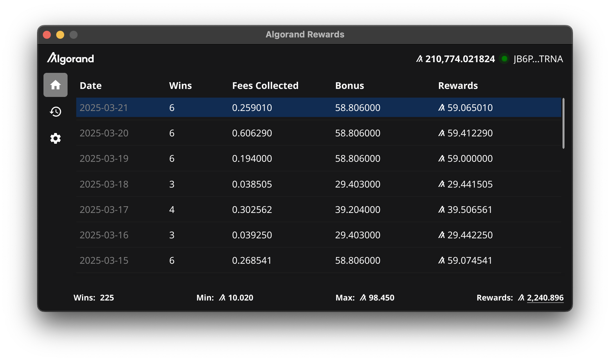
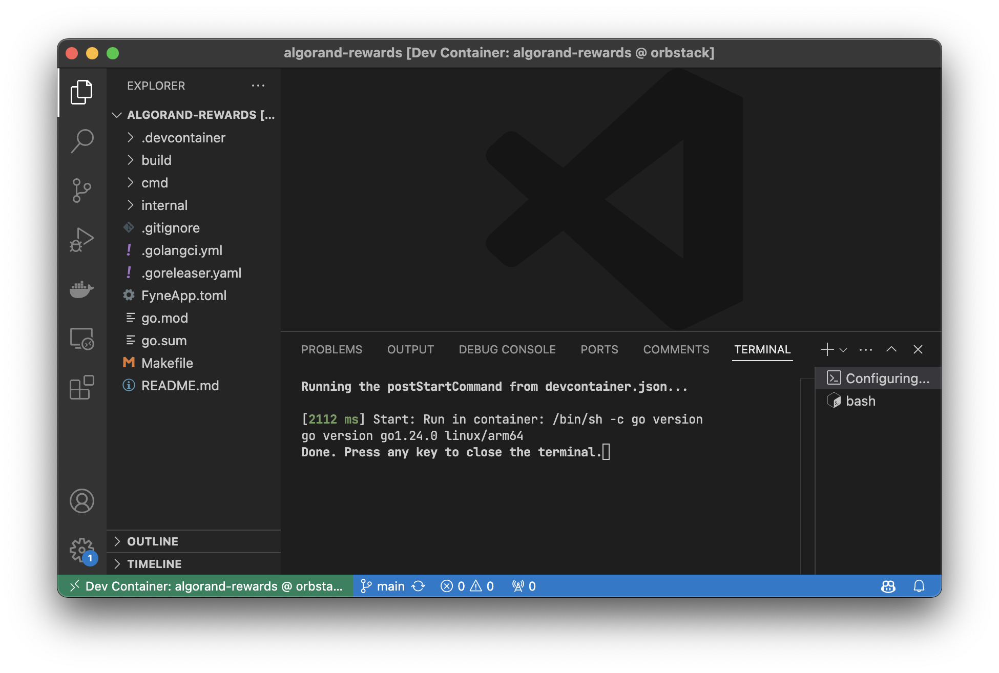

# Algorand Rewards



## Description
Algorand Rewards is a simple desktop application for Windows, MacOS, and Linux written in Go using [Fyne](https://github.com/fyne-io/fyne). This application is used for tracking rewards from [Algorand](https://github.com/algorand/go-algorand). The application uses [Nodely AVM endpoints](https://nodely.io/docs/free/endpoints/) to fetch wallet address rewards and displays them in a table grouped by date. 

## Why?
I wanted to create a simple desktop application for tracking rewards from Algorand. I couldn't find any existing applications that did this, so I decided to create one.

## Who is this for?
This application is for anyone who wants to track rewards from Algorand.

## Is this safe?
Yes, the application does not store any sensitive information. Only the public wallet address is stored in the application settings. The application does not have access to or make use of private keys or any other sensitive information. If you are still concerned, you can review the source code and build the application from source yourself.

## Features
- Fetch rewards for a wallet address.
- Display rewards in a table grouped by date.
- Settings to configure wallet address.
- Refresh option to fetch rewards again.
- Caching for faster subsequent fetches.

## Installation
Download the latest release from the [releases page](https://github.com/calmdev/algorand-rewards/releases) and install it on your system.

## Building from Source
Docker is used to build the application for Windows, MacOS, and Linux. If you do not have Docker installed, please visit the [official Docker website](https://www.docker.com/get-started) to install it.

Development is done using the Go Programming Language. The Go version is specified in the project's [go.mod](./go.mod) file. This document assumes you have a functioning environment set up. If you need assistance setting up an environment, please visit the [official Go documentation website](https://go.dev/doc).

### Initial Environment Setup
A [development container](https://containers.dev) is provided for Visual Studio Code users. If you are using Visual Studio Code, you can open the project in a devcontainer by selecting the "Reopen in Container" option when prompted. The container has all the necessary tools and dependencies installed to build the application. If you are not using Visual Studio Code, you can still use the provided devcontainer configuration to set up your environment. For more details, refer to the [.devcontainer](./.devcontainer) directory.

<details>
    <summary>Development Container Screenshot</summary>
    
</details>

### Build
To build the application, run the following command:

```
make build
```

Building the application for MacOS requires a MacOS environment with Xcode SDK tooling. The `make build` command will build the application for Windows and Linux only if you are not on a MacOS environment.

The build output will be located in the `fyne-cross` directory.

<details>
    <summary>Build Output Structure</summary>
    <ul>
        <li><code>bin</code> - contains the go binary built for each platform.</li>
        <li><code>dist</code> - contains the packaged application for each platform.</li>
    </ul>
    <pre>
fyne-cross
├── bin
│   ├── darwin-arm64
│   ├── linux-arm64
│   ├── windows-arm64
│   └── etc
└── dist
    ├── darwin-arm64
    ├── linux-arm64
    ├── windows-arm64
    └── etc
    </pre>
</details>

#### DMG & MSI Packaging
The build process will not create macOS DMG or Windows MSI packages. These are features of [goreleaser](https://goreleaser.com/) that are only available in the pro version. These artifacts are uploaded and made available on the releases page of this repository when a new release is created. They're essentially a wrapper around the application binary produced by `make build` which provide a more user-friendly installation experience and are not required to build the application itself.

### Makefile Help
To see all available make commands, run the following command:

```
make help
```

## Support
For questions or help, please open an issue on the issues page. Consider supporting this project if you find it useful by starring it or by making a donation to the following algorand wallet address:

```
JB6PZJA54UQC5OLOCOGU7IZI65ROGQ5TYZSGQFE7DJN2XWFJIDFZSZTRNA
```